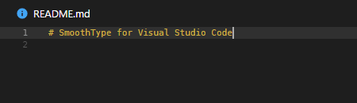

# SmoothType for Visual Studio Code

**This extension adds a smooth typing animation,
similar to MS Office and the Windows 10 Mail app.**

[](https://marketplace.visualstudio.com/items?itemName=spikespaz.vscode-smoothtype)
[](https://marketplace.visualstudio.com/items?itemName=spikespaz.vscode-smoothtype)

**Get it from the [Visual Studio Marketplace](https://marketplace.visualstudio.com/items?itemName=spikespaz.vscode-smoothtype).**

**Note:** Please scroll down and read the section labeled [Important](#important).

## Preview



## Commands

 * `SmoothType: Enable Animation`
 * `SmoothType: Disable Animation`
 * `SmoothType: Reload Animation`

## Configuration

```js
{
  // Duration in milliseconds for the cursor to travel from one character position (or line) to the next.
  "smoothtype.duration": 80,
  // Ask before restarting after a command is successfully run.
  "smoothtype.autoReload": false
}
```

After changing `smoothtype.duration`, you must run `SmoothType: Enable Animation`.

## Important

Because Visual Studio Code does not have an API for modifying the editor CSS, this extension modifies the core index file that is loaded by the Electron browser. After enabling Smooth Typing, the editor may complain that it is corrupt, and ask you to reinstall. This is perfectly normal, and perfectly safe. Just click the cog on the top of the notification and elect to not be shown this message again.

The editor may also append `[Unsupported]` to the end of the window title. This is also fine.

**After every update, the extension must either be reloaded or enabled again.**

You also have to restart Visual Studio Code after every reload or change.

## Donations

If you would like to show appreciation for my work, I would gladly accept a small donation!

I will accept donations through PayPal.Me, Buy Me a Coffee, or Patreon.

[](https://buymeacoffee.com/spikespaz)
[](https://paypal.me/spikespaz)
[](https://patreon.com/spikespaz)
