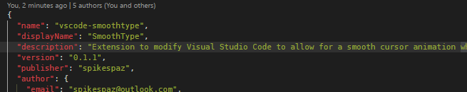
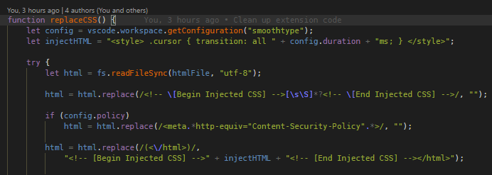

# SmoothType for Visual Studio Code

**This extension adds a smooth typing animation,
similar to MS Office and the Windows 10 Mail app.**

(Just ignore the typo :P)

### Commands

 * `Enable Smooth Typing`
 * `Disable Smooth Typing`
 * `Reload Smooth Typing`

### Configuration

Modify the value of `smoothtype.duration` in your `settings.json`
to adjust the duration of the transition to your preference.

The value is in milliseconds, the default is 80.

### Important

**After every update, the extension must either be reloaded or enabled again.**
